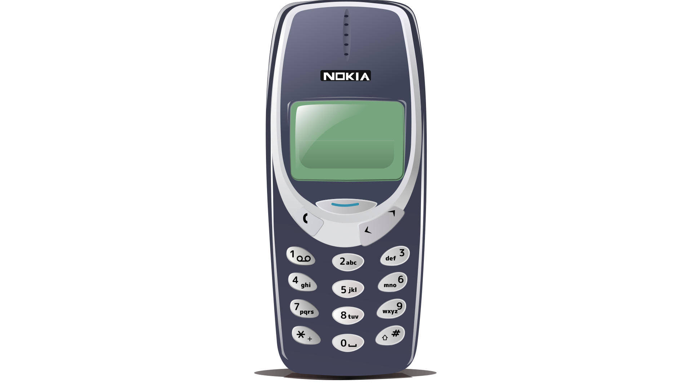

# 📱 Nokia 3310 Developer Portfolio

A fully interactive, nostalgic web experience built with **React**, **Vite**, and **Tailwind CSS**. This project transforms a standard developer portfolio into a meticulously recreated, fully playable Nokia 3310.



🌐 **[View Live Demo](https://tanmayhutt.github.io/nokia-desk/)**

---

## ✨ Features

- **Pixel-Perfect Retro UI:** Authentic chunky pixel fonts, classic Nokia menu systems, and that iconic green LCD glow.
- **Hardware Integration:** 
  - 🔋 **Live Battery:** The battery indicator on the screen maps directly to your actual physical device's battery using the Web Battery API.
  - 📶 **Live Signal:** The signal bars map to your real network connection status.
- **Fully Interactive Keypad:** Click or use your keyboard to navigate menus, dial numbers, or type!
- **Playable Snake Game:** Because it wouldn't be a Nokia without a fully functional clone of classic Snake.
- **Xpress-on™ Covers:** Dynamically change the physical color of the phone casing on the fly.
- **Dynamic Backlight:** Toggle the screen backlight on and off using the `*` key.
- **Bouncy Screensaver:** Leave the phone idle and watch the retro bouncing clock screensaver activate.
- **Developer Terminal:** A built-in pseudo-terminal for typing commands and navigating the portfolio.

## 🛠 Tech Stack

- **Framework:** React 19 + Vite
- **Styling:** Tailwind CSS v4
- **Deployment:** GitHub Pages
- **Icons & Graphics:** SVG-based modeling for crisp scaling across all resolutions.
- **Audio:** Web Audio API for authentic, synthetically generated retro beeps and boops.

## 🚀 Getting Started

To run this project locally on your machine:

1. **Clone the repository:**
   ```bash
   git clone https://github.com/tanmayhutt/nokia-desk.git
   cd nokia-desk
   ```

2. **Install dependencies:**
   ```bash
   npm install
   ```

3. **Start the development server:**
   ```bash
   npm run dev
   ```

4. **Open your browser:**
   Navigate to `http://localhost:5173`

## 📦 Deployment

This project is configured to automatically deploy to GitHub pages. To deploy your own version:

```bash
npm run deploy
```
*(Make sure to update the `base` path in `vite.config.js` if you host it on a different domain or path).*

## 🤝 Contributing

Feel free to fork this repository, add your own "apps" to the Nokia menu, or customize the portfolio data in `src/components/NokiaData.jsx` to make it your own!

---
*Built for nostalgia and fun.*
